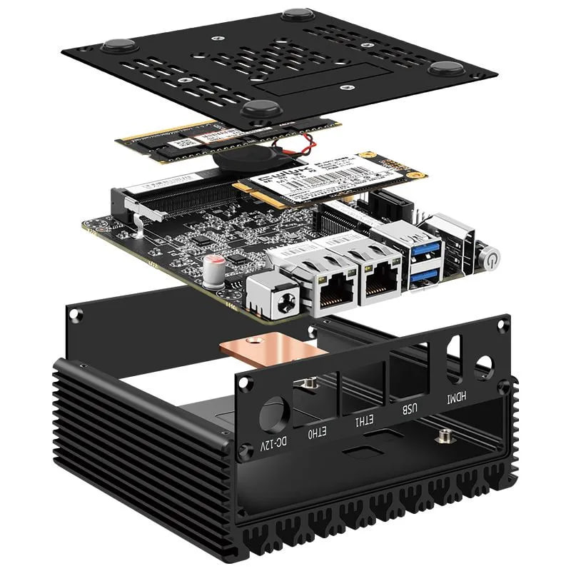
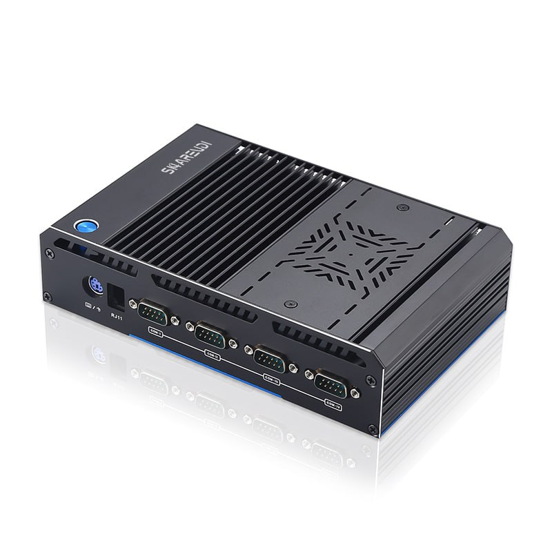
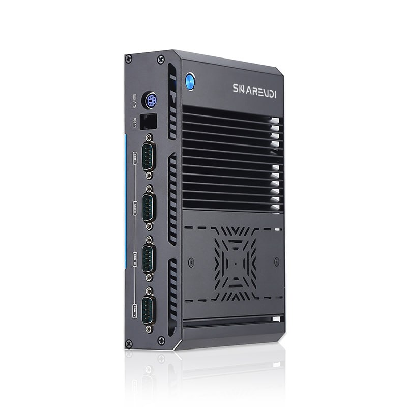
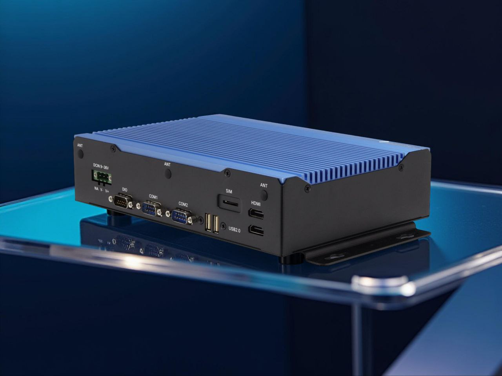
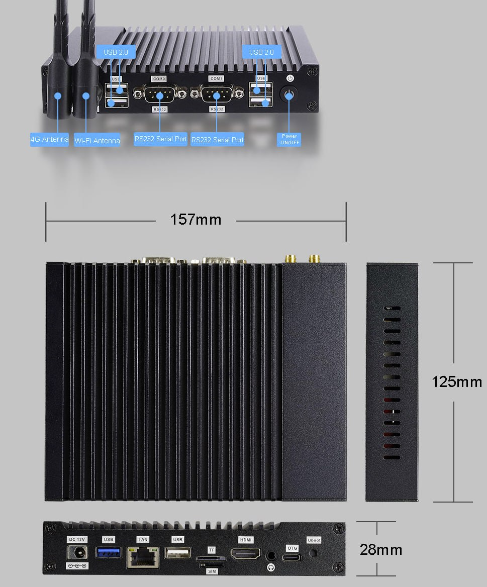
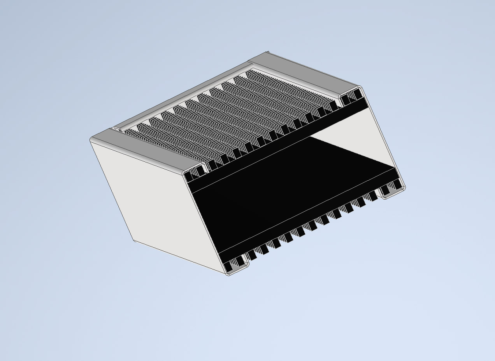

<h1 align="center">Дизайн корпуса</h1>

<h3 align="center">Пример дизайна Topton и CWWK</h3>

    

<h3 align="center">Дизайн пром ПК на основе радиатора и гнушки</h3>

    

    

<h3 align="center">Пример корпуса с кронштейнами для крепления</h3>

    

<h3 align="center">Простой корпус для роутера</h3>

  

    

<h3 align="center">Концепт простого корпуса</h3>

  

    

