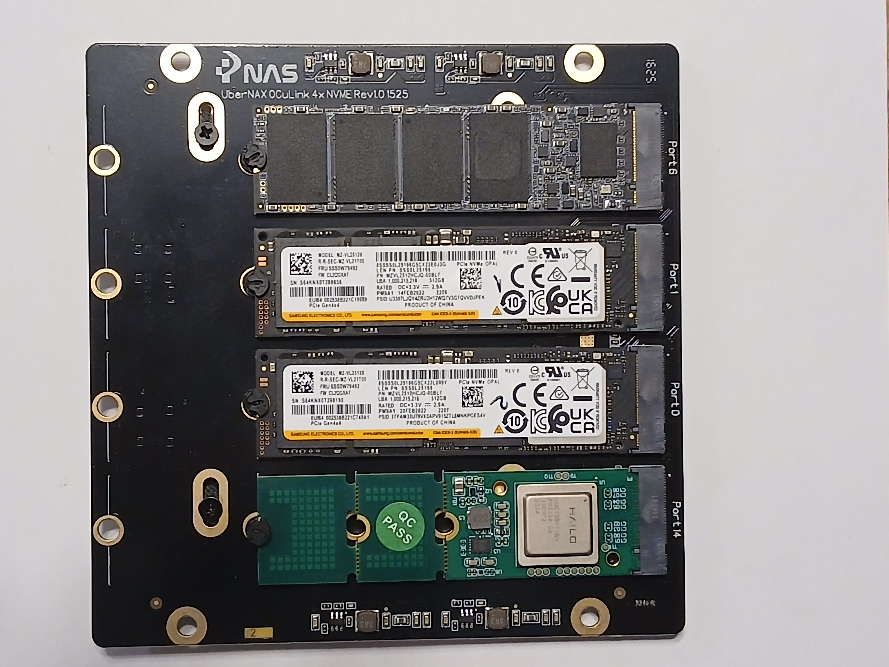

# Примеры фото общего вида

| Изображение (превью) | Описание |
|----------------------|----------|
|  | Модуль UberNAX с установленным NPU ускорителем и тремя дисками M.2 NVME |
|  | Готовая NAS-система с 4× NVMe и пассивным радиатором |
|  | AI-сервер / NAS с 6 портами Ethernet |
